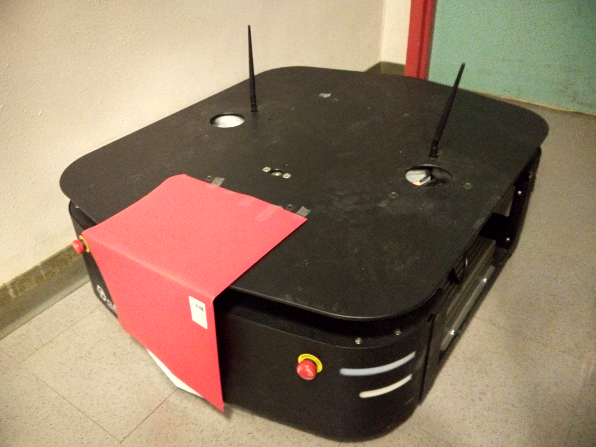
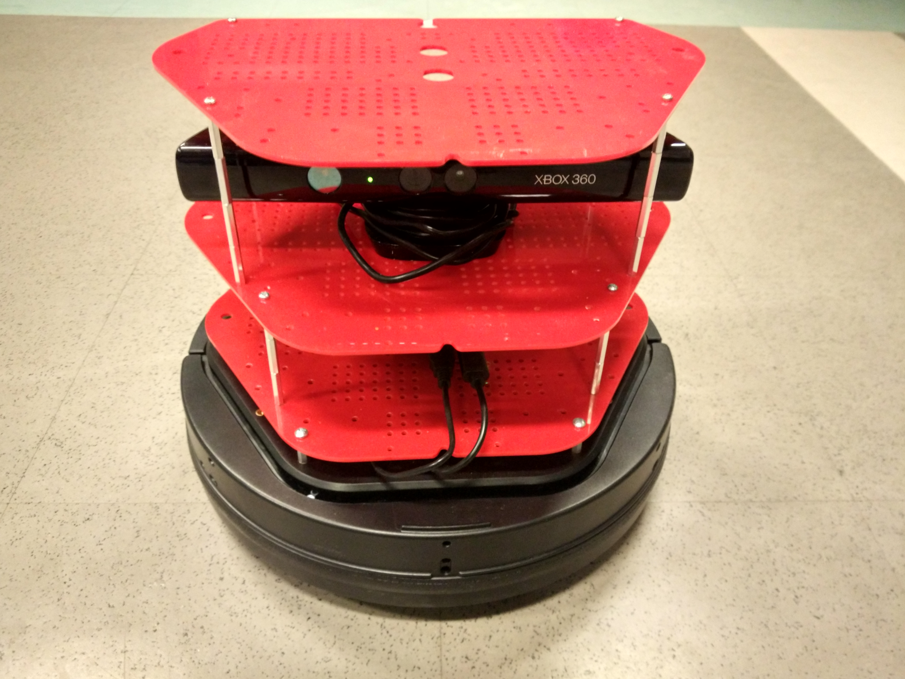
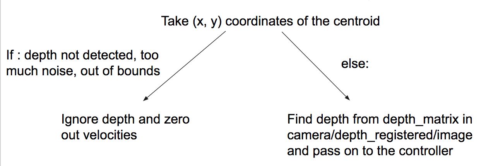
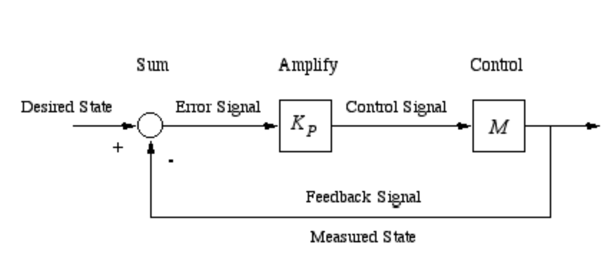

## Turtlebot Follower

### Introduction
Imagine if you could walk around the airport with your suitcase following you at every turn, as you stop, speed up, or even turn --completely hands free. Our project is to construct a program from scratch for a Turtlebot to identify and follow the likeliest red target by controlling the angle and distance from it.  Additionally in the works is the turtlebot tracking and following a particular face. Through implenting non-AR-tag vision, our project has to overcome challenges such as accurately identifying its target from constantly changing surrounding and mirroring in real time the target's movement change.  This dynamic robotic shadowing technology, however, can be incoporated into applications that provide convenience to people's movement.  

### Design
#### Design Criteria: 
- Our turtlebot should be able to process its surroundings and choose the likeliest red target
   - The code should identify the target's shape and determine if the red is the desired red quadrilateral target
   - The code should get the target's position in x, y coordinates
- The code should minimze the error between the actual target centroid and the turtlebot's view of the target centroid
- The turtlebot should be able to estimate the depth between it and the target, maintaining a set distance away
   - The turtlebot can move foward and back depending on the target's movement
   - The turtlebot will turn according to the target's movement in real-time without losing sight of it's target

#### Design We Chose  
1. Computer Vision/Image Processing:  
- Retrieve surroundings of the turtlebot in real-time using the kinect's RGB camera. (Topic: /camera/rgb/image_color)     
- Identify the red target by filtering the red pixels and use OpenCV's library to outline the target
- Find the x, y coordinates of the target's center   

2. Depth Processing:  
- Use the kinect's 3D sensor to collect of depth corresponding to each pixel seen from the camera (Topic: /camera/depth_registered/image)  
- Knowing x, y coordinates, find the depth or z coordinate associated with that point.
   
3. Control Turtlebot to Track:  
- Use proportional feedback to control the turtlebot so it may move faster when there is greater difference between the target's centroid and the desired distance and orientation it should maintain from the target

#### Design Choices and Trade-offs 
1. ar_track_alvar vs non-AR-tag vision:  
   - Using the existing ar_track_alvar would have been much easier but it would be limited to following AR tags.  The tradeoff for implenting our own non-AR tag vision is that we had to account for cases of identifying the right target and image-processing delay.  
2. red folder or face detection vs another target:
   - Another target such as a human may have been easier to implement as we could use the skeleton etimated by the kinect.  However, we chose to implement our own computer vision and controller code from scratch, which allowed us to work with many interesting problems when we chose to process and identify the target.  Additionally, the red folder or face target allowed us to have better control over moving the target for the turtlebot to track. 
   

#### Relation to Real-World Criteria  
Robustness: 
Since we chose to identify a red target, a challenge in the design criteria is accurately identifying the target when there are multiple red objects in the turtlebot's view.  Even with OpenCV's contour detection and ApproxPolyDP, a distractor red object in the surrounding may interfere with the centroid identification, risking an outlying point to distort the shape of the identified target.  

Durability:
To make the turtlebot follower more durable, we would need to ensure that the turtlebot behaves stably under different conditions of lighting, room settings, etc.  Different settings can make identifying the target less reliable as the target detection may fall out of the range of tolerability.  

Efficiency:
A big issue we faced was accounting for the image-processing delay, which caused overshoot and significant oscillation. We tried to fix this by adding derivative control and tuning speed and tolerance constraints.   


### Implementation
a) Describe any hardware you used or built. Illustrate with pictures and diagrams.
We attached a red target onto the ridgeback to create a moving target.  A turtlebot was programmed to follow this target.

  

b) What parts did you use to build your solution?  

c) Describe any software you wrote in detail. Illustrate with diagrams, flow charts, and/or other appropriate visuals. This includes launch files, URDFs, etc.  

d) How does your complete system work? Describe each step.
#### Computer Vision

##### Red Folder Detection

 
    
This is the original image. Original image subscribed from topic: ```camera/rgb/image_color```. We developed a Python parser for ~100 MB topic output file in order to reconstruct a scene (series of ~25 frames). We could then use Jupyter Notebook in Python with different libraries to test out different algorithms. 


---


We converted the image to HSV image (hue, saturation, value) to be able to filter out all colors except a range of shade of red hues. The white regions are those pixels that have not been filtered out while the white images have been filtered out.

--- 


We reinsert original redness into image simply for visualization. Not essential for detection but useful for initial threshold testing. 

--- 


We applied Gaussian blur to the image. This should smooth out whiteness to create solid block. We then converted it to a black and white with a set light threshold

---


We used OpenCV's contour detection to find all the contours in the image and then found the max contour of the blurred/ thresholded image. We reinserted the maximum contour into the original image to test its performance. This contour is effectively a bounding region for the red folder of interest.

---


We used OpenCV's ApproxPolyDP which calls an implementation of Douglas Pecker's algorithm on a particular contour. This algorithm fits a polygon through the contour given a particular error threshold. I knew the red folder would always be a quadrilateral so I implemented a controlled search over the error parameter to find an error threshold to generate a quadrilateral. This algorithm generally gives us the 4 corners of the quadrilateral which we can use find the centroid

---

##### Face Recognition [work in progress]


As on our reach goals, we decided to extend recognition with existing controls to use face recognition to get the centroid. We used pre-trained OpenCV neural network classifier. This network is traditionally used for face recognition in webcams. This model needs training with our image in particular rather than standard facial features and would be much better if we used one image. This approach has great potential for high accuracy with simple bounding box and has been done many times in the past.

---
#### Depth Processing


#### Feedback Control 
  
With desired x, y, z coordinates, we control the linear x and angular z velocities of the turtlebot. This allows us to set the angular direction and forward velocities so we can move the bot wherever we want.  We set a reference z position for the turtlebot to maintain from the target (0.75m).  The turtlebot tries to maintain the centroid of the image in the center of the image it sees, with some tolerance.  Both angular and linear velocities were controlled with proportional feedback controllers.  The individual proportional gains were tuned for best performance.


### Results
a) How well did your project work? What tasks did it perform? 
Bellow are the videos of our project in action.  The first two videos demonstrate the turtlebot tracking and following the red target on the moving ridgeback.  The last video shows the turtlebot performing facial recognition and maintaining its angle and distance from the targeted face.  
b) Illustrate with pictures and at least one video.
<video src="demovideos/red.mp4" width="480" height="300" controls preload></video>
<video src="demovideos/red2.mp4" width="480" height="300" controls preload></video>
<video src="demovideos/face_detection.mp4" width="480" height="300" controls preload></video>

### Conclusion
(a) Discuss your results. How well did your finished solution meet your design criteria?  
Our turtlebot is able to track and follow the moving red target, a red folder in this case.  In our finished solution, the turtlebot senses from the RGB camera and depth sensor to acquire the position of the red target and the estimated depth of each pixel for that snapshot of its surroundings.  Once the x, y, z coordinates of the centroid are calculated, the turtlebot actuates with proportional feedback control.  

(b) Did you encounter any particular difficulties?  
One of the challenges we faced was providing constant velocity for the for more than 0.6 seconds.  Although the turtlebot requires this to move, the velocity of the turtlebot is constantly being updated as it detects changes in the target's movement and position.  We also experimented with zumys as our moving target, but we had difficulties controlling the zumys.  For the red folder detection, we also had to minimize the instannces of confusion when the turtlebot sees multiple red objects in its view.  Turtlebot's constantly changing position in space can pose a challenge in reliably detecting one red target.  Especially since there exists a delay between the turtlebot's understanding of the target's change in movement and the execution of turtlebot's own movement, the turtlebot may lose sight of the target or have incorrect depth data associated with the centroid point that it identified, as the centroid may now have moved aside to a different point in space.  We overcame this problem by taking a snapshot of the depths associated with the image at the point when the turtlebot begins to find the target centroid by processing its surroundings.  

(c) Does your solution have any flaws or hacks? What improvements would you make if you had additional time?  
Our solution performs well under most circumstances, though a flaw may be the delay between the turtlebot's image capturing and excution of motion, which may cause the turtlebot to overshoot while turning and subsequent oscillation as the turtlebot tries to correct for the overshoot.  If we had more time, we would try to implement a more robust way of predicting the target's movement in the next time frame to account for the delay on the turtlebot's part and minimize the risk of overshooting.  Additionally if time allowed, we were also interested in programming the turtlebot to identify target containing words (convolutional neural net/ OCR) and follow while avoiding obstacles.


### Team
a) 
Girish Balaji
Rushil Goradia - ME/EECS Major, Senior, Interested in Controls and state estimation.
Cassie Yin

b) Describe the major contributions of each team member.
Girish - 
Rushil - Designed the ROS framework and topics, and implemented the controllers for linear and angular velocities. 
Cassie - 

### Additional materials
(a) code, URDFs, and launch files you wrote  <insert repo link here>
(b) CAD models for any hardware you designed <no custom hardware> 
(c) data sheets for components used in your system
   <!---  --->
   <!--- [Turtlebot Data Sheet](https://github.com/cyin3/ee106a-final-project/blob/master/TURTLEBOT_DATA_SHEET_2015_web.pdf)  ---> 
   <!--- [Ridgeback Data Sheet](https://github.com/cyin3/ee106a-final-project/blob/master/Ridgeback_DataSheet_2016.pdf)  --->
   [Ridgeback Data Sheet](https://static.generation-robots.com/img/products/Ridgeback_DataSheet_2016.pdf)
   [Turtlebot Data Sheet](TURTLEBOT_DATA_SHEET_2015_web.pdf)
   
(d) any additional videos, images, or data from your finished solution
(e) links to other public sites (e.g., GitHub), if that is where your files are stored

### Fun


