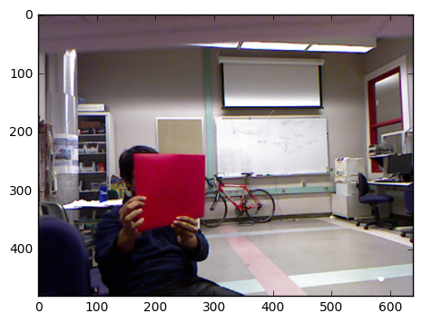
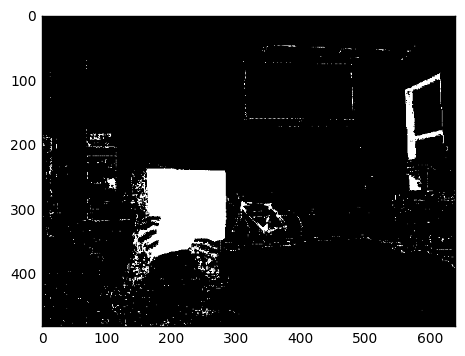
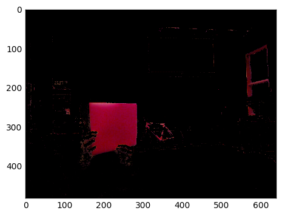
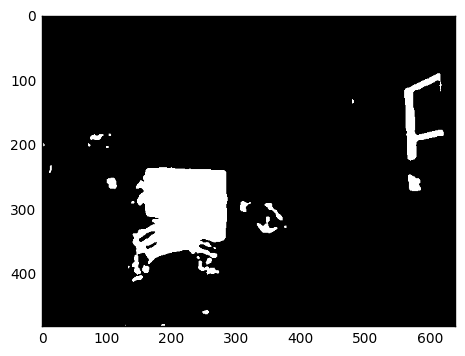
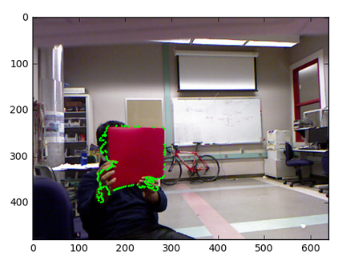
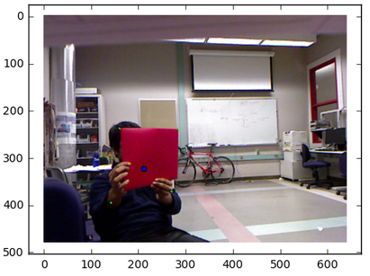
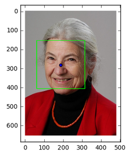

## Turtlebot Follower

### Introduction
a) The end goal of this project is to program a turtlebot with the ability to identify and follow the likeliest red target by controlling the angle and distance from it.  
b) This is an interesting project because for non-AR-tag vision, we had to solve problems such as correctly identifying the red target from its surroundings and be able to follow in real time the target's change in movement.  
c) Our project can be applied to real-world robotic applciations that involves tracking and following, such as a robot suitcase.  

### Design
a) Design criteria: 
Our turtlebot should process the surroundings to identify the likeliest red quadrilateral as the target and use feedback control to minimize the error between the target's centroid and our centroid in the turtlebot's point of view.   
b) Describe the design you chose.

c) What design choices did you make when you formulated your design? What trade-offs did you have to make?   
We chose to implement basic signal processing algorithms to identify the red target in the turtlebot's environment because we could not getting ar_track_alvar to using the turtlebot camera, which required calibration.  The tradeoff that we had to make was to use computer vision and implement an algorithm from scratch to identify the moving red target.

d) How do these design choices impact how well the project meets design criteria that would be encountered in a real engineering application, such as robustness, durability, and efficiency?  
Since we chose to identify a red target, a challenge in the design criteria is accurately identifying the target when there are multiple red objects in the turtlebot's view.  Possible distractors from the red target can arise from different room settings or lighting.  We strived to increase the robustness of our computer vision algorithm.  

### Computer Vision

#### Red Folder Detection

 
    
This is the original image. Original image subscribed from topic: ```camera/rgb/image_color```. We developed a Python parser for ~100 MB topic output file in order to reconstruct a scene (series of ~25 frames). We could then use Jupyter Notebook in Python with different libraries to test out different algorithms. 


---



We converted the image to HSV image (hue, saturation, value) to be able to filter out all colors except a range of shade of red hues. The white regions are those pixels that have not been filtered out while the white images have been filtered out.

--- 




We reinsert original redness into image simply for visualization. Not essential for detection but useful for initial threshold testing. 

--- 



We applied Gaussian blur to the image. This should smooth out whiteness to create solid block. We then converted it to a black and white with a set light threshold

---



We used OpenCV's contour detection to find all the contours in the image and then found the max contour of the blurred/ thresholded image. We reinserted the maximum contour into the original image to test its performance. This contour is effectively a bounding region for the red folder of interest.

---



We used OpenCV's ApproxPolyDP which calls an implementation of Douglas Pecker's algorithm on a particular contour. This algorithm fits a polygon through the contour given a particular error threshold. I knew the red folder would always be a quadrilateral so I implemented a controlled search over the error parameter to find an error threshold to generate a quadrilateral. This algorithm generally gives us the 4 corners of the quadrilateral which we can use find the centroid

---

#### Face Recognition [work in progress]


As on our reach goals, we decided to extend recognition with existing controls to use face recognition to get the centroid. We used pre-trained OpenCV neural network classifier. This network is traditionally used for face recognition in webcams. This model needs training with our image in particular rather than standard facial features and would be much better if we used one image. This approach has great potential for high accuracy with simple bounding box and has been done many times in the past.


---

### Implementation
a) Describe any hardware you used or built. Illustrate with pictures and diagrams.
We attached a red target onto the ridgeback to create a moving target.  A turtlebot was programmed to follow this target.
Insert pic
b) What parts did you use to build your solution?

c) Describe any software you wrote in detail. Illustrate with diagrams, flow charts, and/or other appropriate visuals. This includes launch files, URDFs, etc.
d) How does your complete system work? Describe each step.

### Results
a) How well did your project work? What tasks did it perform? 
b) Illustrate with pictures and at least one video.
<video src="demovideos/red.mp4" width="480" height="300" controls preload></video>
<video src="demovideos/red2.mp4" width="320" height="200" controls preload></video>
<video src="demovideos/face_detection.mp4" width="320" height="200" controls preload></video>

### Conclusion

### Team
a) Include names and short bios of each member of your project group.b) Describe the major contributions of each team member.

### Additional materials
(a) code, URDFs, and launch files you wrote (b) CAD models for any hardware you designed
(c) data sheets for components used in your system
(d) any additional videos, images, or data from your finished solution
(e) links to other public sites (e.g., GitHub), if that is where your files are stored

### Fun


```markdown
Syntax highlighted code block

# Header 1
## Header 2
### Header 3

- Bulleted
- List

1. Numbered
2. List

**Bold** and _Italic_ and `Code` text

[Link](url) and 
```

For more details see [GitHub Flavored Markdown](https://guides.github.com/features/mastering-markdown/).
